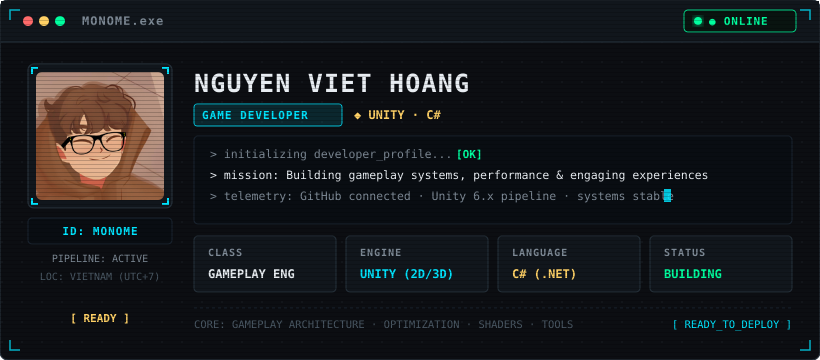
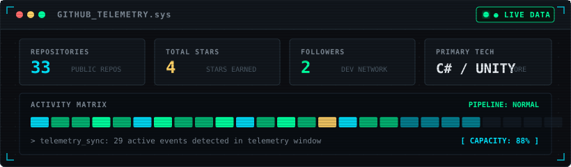
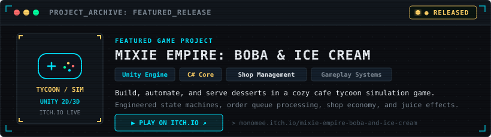

<div align="center">

  <!-- 01 // MAIN HERO PROFILE CARD -->
  

</div>

<br />

```text
> SYSTEM_SPEC: Nguyen Viet Hoang (Monome) · Gameplay Engineer
> FOCUS: Core gameplay systems, state architecture, and performance optimization in Unity & C#
> CURRENT_OBJECTIVE: Developing simulation & grid-based game mechanics with modular architecture
```

<div align="center">

  <!-- 02 // GITHUB TELEMETRY CARD -->
  

</div>

<br />

### 🛠️ `SYSTEM_MODULES` // Languages & Tools

<div align="center">

  <!-- 03 // TECH STACK CARD -->
  

</div>

<br />

<div align="center">
  <a href="https://unity.com/" target="_blank"></a>
  <a href="https://learn.microsoft.com/en-us/dotnet/csharp/" target="_blank"></a>
  <a href="https://git-scm.com/" target="_blank"></a>
  <a href="https://developer.mozilla.org/en-US/docs/Web/JavaScript" target="_blank"></a>
  <a href="https://www.python.org/" target="_blank"></a>
  <a href="https://www.java.com/" target="_blank"></a>
</div>

<br />

### 🎮 `PROJECT_ARCHIVE` // Featured Release

<div align="center">

  <!-- 04 // FEATURED PROJECT CARD (CLICKABLE) -->
  <a href="https://monomee.itch.io/mixie-empire-boba-and-ice-cream" target="_blank" rel="noopener noreferrer">
    
  </a>

</div>

<br />

### 🌐 `COMMUNICATION_LINK` // Connect

<div align="center">
  <a href="https://portfolio-nguyen-viet-hoang.vercel.app/" target="_blank" rel="noopener noreferrer">
    
  </a>
  <a href="https://monomee.itch.io/mixie-empire-boba-and-ice-cream" target="_blank" rel="noopener noreferrer">
    
  </a>
  <a href="https://www.linkedin.com/in/hoang-nguyen-viet765/" target="_blank" rel="noopener noreferrer">
    
  </a>
  <a href="mailto:hoangthth12@gmail.com">
    
  </a>
</div>

<br />

---

<div align="center">
  <sub>⚡ TERMINAL SESSION: <code>MONOME // 2026.4</code> · BUILT WITH ZERO-DEPENDENCY NODE.JS & SVG HUD RENDERER</sub>
</div>
